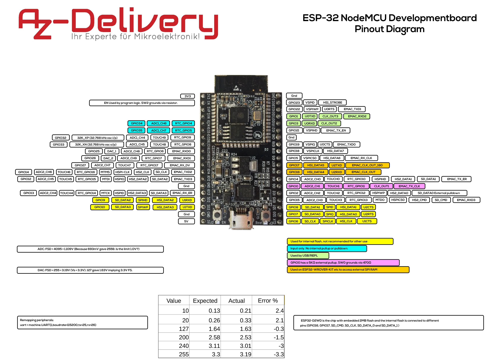

# esp32-projects

### [ESP32 Cam Project](esp32cam.yaml)
Remote security using esp32-cam board with Ov2640 camera module.  
Integrates into homeassistant/esphome.
Exposes a live video stream, a button for the flash light, and a button to reset the device.

## ESP32 Pin layout
*AZ-Delivery ESP32-WROOM-32*
